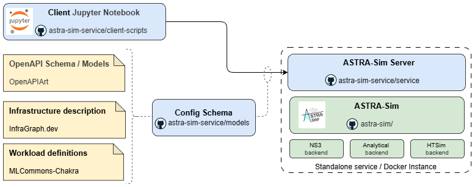

# ASTRA-sim Service

ASTRA-sim Service hides the complexity of configuring and running ASTRA-sim simulations by providing an OpenAPI-based [OpenAPIArt](https://github.com/open-traffic-generator/openapiart/tree/main) interface. It allows users to set up, control, and monitor simulations as remote services. The service supports flexible workload configuration using [MLCommons Chakra](https://github.com/mlcommons/chakra) and infrastructure modeling with [InfraGraph](https://infragraph.dev/). Users can easily configure simulation settings through Jupyter notebooks for interactive experimentation. The repository offers options for both Docker-based and standalone services, and includes ready-to-use sample notebooks for quick start.



## Getting Started

### 1. Development Environment

The project uses **VS Code Dev Containers** to ensure a reproducible and isolated development setup.

- Base image: ubuntu:22.04
- This will install dependencies like: Python 3.x, gRPC tools, Make, CMake, and simulation dependencies. For all the dependent packages please check [Dockerfile.devenv](Dockerfile.devenv)
- The dev container automatically sets up your environment, installs packages, and provides consistent build behavior across developers.

This environment is particularly useful for contributors who want a ready-to-use setup for model updates, client testing, or service development.

---

### 2. Deploy ASTRA-sim Service
#### 2a. As a Docker Container

The repository provides a Docker-based build for deploying the ASTRA-sim service in an isolated environment.

To build the Docker image:

```
make build-service-docker
```

To run the Docker image:

```
docker run -it astra_sim_service:<tag>
```

Where tag == version. For example for version 0.0.6, the command would be

```
docker run -it astra_sim_service:0.0.6
```


Once built, the image can be run independently and accessed remotely using the exposed host IP and port. Clients (via notebooks or scripts) can connect to this containerized service for distributed simulation execution.

---

#### 2b. Local build/run
##### 1) Build the service

To build the astra-sim-service inside VS Code Dev Container:
```
make install-prerequisites
make build-all
```

- `make install-prerequisites`: Installs all required dependencies, libraries, and supporting tools.
- `make build-all`: Executes the full build pipeline:
  1. Builds the model artifacts.
  2. Runs tests for client scripts.
  3. Builds and tests the service components.

##### 2) Run the Service

After a successful build, the service can be started locally using:

```
cd service/astra_server
python3 __main__.py
```


This command launches the ASTRA-sim gRPC server, exposing it for client connections.

---

### 3. Using the Client Notebooks

You can run any of the client Jupyter notebooks provided under [client-scripts/notebooks](client-scripts/notebooks). The easiest approach is to open the notebooks using the [VS Code Jupyter extension](https://marketplace.visualstudio.com/items?itemName=ms-toolsai.jupyter). Configure the server endpoint of the running ASTRA-sim service (the server endpoint is displayed in the service/docker logs) at the top of the notebook, and run the rest of the notebook interactively. Refer to the README one level above ([client-scripts/README.md](client-scripts/)) for a description of each notebook.


## Repository Overview

The ASTRA-sim Service architecture consists of the following key components:

- models: [Read the model documentation](models/README.md)
Define the schema for ASTRA-sim configuration and infrastructure descriptions. These models are specified using [openapiart](https://github.com/open-traffic-generator/openapiart/tree/main), providing a neutral and extensible format for capturing system and simulation details.
- service: [Read the service documentation](service/README.md)
Implements the ASTRA-sim server that runs using gRPC. It serves as the execution backend for simulation requests from clients.
- client-scripts: [Read the client-scripts documentation](client-scripts/README.md)
Provide user-facing interfaces, including Jupyter notebooks, that allow users to configure simulations, trigger runs, and visualize results.

The combination of these components supports model-driven simulation workflows where users can define ASTRA-sim setups programmatically, launch remote simulations, and analyze outcomes - all from interactive notebooks.

## Contributing

You can contribute to ASTRA-sim Service in the following ways:

- Open an issue in the repository to report bugs or request features.
- Fork the repository and submit a pull request (PR) with your changes or extensions.

Contributions are welcome across models, clients, and service to improve schema definitions, enhance notebook scripts, and extend server performance.

### Contributors

| Name | Role | GitHub | Organization |
|------|------|--------|--------|
| Amos Rai | Contributor | [@Amos-Rai-KEYS](https://github.com/Amos-Rai-KEYS) | Keysight |
| Harsh Sikhwal | Maintainer | [@harsh-sikhwal](https://github.com/harsh-sikhwal) | Keysight |
| Jinsun Yoo | Maintainer | [@jinsun-yoo](https://github.com/jinsun-yoo) | Georgia Tech |